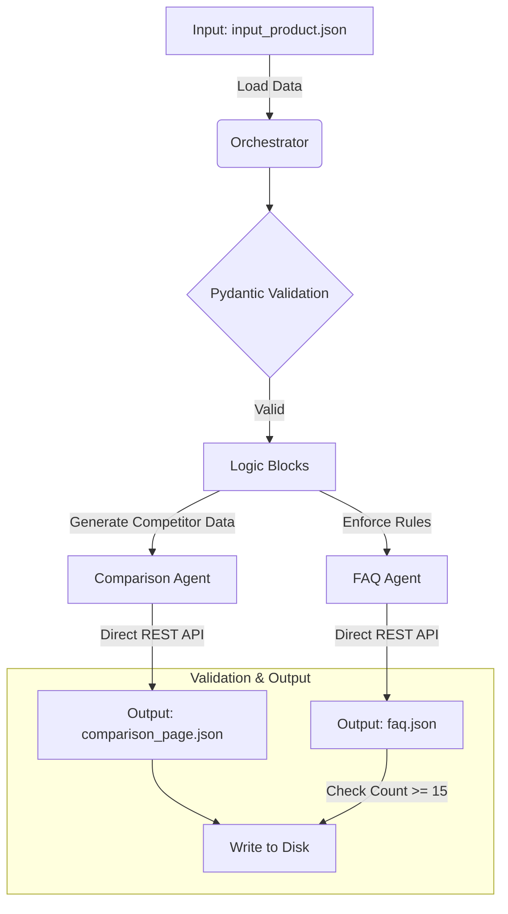

KASPARRO PROJECT
Author: Hrithik Krishna
Repository: kasparro-agentic-hrithik-k

1. PROBLEM STATEMENT
The objective is to design a modular, agentic automation system capable of ingesting raw product datasets and autonomously generating structured, machine-readable content pages (FAQ, Comparison, and Product Descriptions). The system must move beyond simple LLM prompting to demonstrate true engineering principles: modularity, strict type enforcement, deterministic logic application, and automated workflow orchestration.

2. SOLUTION OVERVIEW
I have implemented a Centralized Orchestrator Architecture. This design treats Large Language Models (LLMs) not as the entire solution, but as specific sub-components (Agents) within a larger software pipeline.

The solution relies on four core pillars:
- Orchestrator: A central manager that handles data ingestion and dictates the execution flow.
- Specialized Agents: Distinct classes (FAQAgent, ComparisonAgent) responsible for creative text generation using Google Gemini 2.5 Flash via a custom Direct REST API layer.
- Logic Blocks: Pure Python functions that handle deterministic rules (e.g., calculating competitor pricing, enforcing FAQ counts), ensuring reliability where AI guessing is unnecessary.
- Validation Layer: Use of Pydantic models to strictly enforce JSON output schemas, preventing hallucinated structures and ensuring production-ready data.

3. SYSTEM DESIGN (ARCHITECTURE)

The system follows a linear Pipeline Pattern managed by the Orchestrator. Below is the automation graph representing the flow of data.

COMPONENT RESPONSIBILITIES (AGENT BOUNDARIES)

1. Logic Blocks (src/logic_blocks.py):

* Responsibility: Handle all non-generative tasks.
* Example: generate_competitor_profile creates the comparison product data programmatically. validate_faq_count enforces the business rule of at least 15 questions before saving.

2. Agents (src/agents.py):

* Responsibility: Transform structured data into creative natural language.
* Design: Each agent is a Class with a single responsibility. They are stateless and receive all necessary context via method arguments.
* Tooling: Uses Google Gemini 2.5 Flash via raw HTTP requests (requests library) to bypass unstable SDK wrappers and ensure connection stability.

3. Orchestrator (src/orchestrator.py):

* Responsibility: The central nervous system. It loads data, calls the Logic Blocks to prepare inputs, dispatches tasks to Agents, triggers Validation, and commits the final Output to disk.

4. KEY ENGINEERING DECISIONS:

* Why Direct REST API? (The Nuclear Option)
During development, standard Python SDKs proved unstable due to version conflicts (Model Not Found). By implementing a Direct HTTP Layer using the requests library, the system bypasses SDK dependency issues completely, ensuring connection stability and immunity to library deprecation.
* Why Pydantic?
The requirement stated Machine-Readable Output. Standard prompting is prone to formatting errors. Pydantic is used to define the schema before generation, allowing the system to validate the AI output programmatically.
* Why Logic Blocks?
The assignment explicitly forbade one big function that calls GPT thrice. By moving the competitor generation and FAQ counting out of the AI prompt and into Python code, the system becomes cheaper, faster, and deterministic.
* Why Google Gemini 2.5 Flash?
Selected gemini-2.5-flash for its superior reasoning capabilities, separate quota bucket (avoiding standard rate limits), and high speed, making it ideal for real-time structured data generation.

5. EXECUTION INSTRUCTIONS:

Follow these steps to replicate the system locally.

PREREQUISITES:

* Python 3.8+
* Google Gemini API Key (Free)

STEPS:

1. Clone the Repository
git clone https://www.google.com/search?q=https://github.com/YOUR_USERNAME/kasparro-agentic-hrithik-k.git
cd kasparro-agentic-hrithik-k
2. Install Dependencies
pip install -r requirements.txt
3. Configure Environment
Create a .env file in the root directory and add your API key:
GEMINI_API_KEY=your_api_key_here
4. Run the Pipeline
python main.py
5. Verify Output
Check the output/ directory. You will see three generated files:

* faq.json (Contains 15+ questions)
* comparison_page.json
* product_page.json

6. PROJECT STRUCTURE:

kasparro-agentic-hrithik-k/
├── data/
│   └── input_product.json
├── output/
├── src/
│   ├── models.py
│   ├── logic_blocks.py
│   ├── agents.py
│   └── orchestrator.py
├── docs/
│   └── projectdocumentation.md
├── main.py
├── requirements.txt
└── README.md
